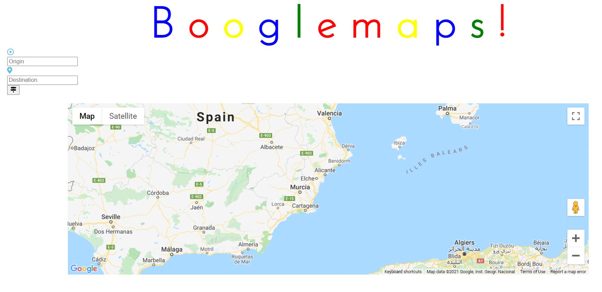
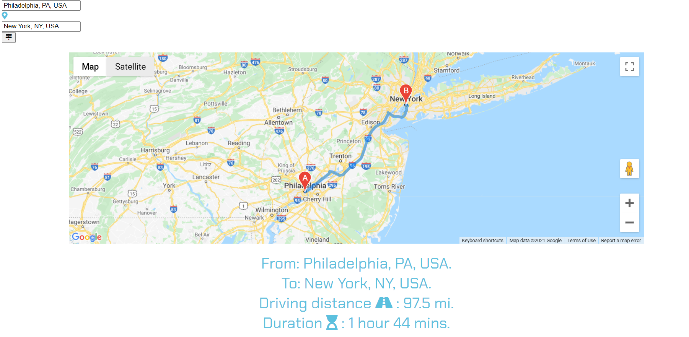

# google-maps-api

This is a site that utilizes the google maps API. I'd been wanting to work with the google maps API for a while now but it's really tricky. I'm glad I figured it out and I'm looking forward to working with this API again.

# Environment Setup

1. Clone my repo at https://github.com/davidmstanleyjr/google-maps-api.

2. CD into it from your terminal and open it in Vs code.

3. Go to the index.html file and click "run in default browser" or "open with live server".

# Technologies Used

1. HTML
2. CSS
3. JavaScript
4. Bootstrap
5. Font Awesome
6. Google Maps API

# Issues

This project was tough because I had to enable the API to do different things and then implement them into my project. I had to turn on autocomplete, places api, maps javascript api and directions api. Writing all that and connecting it to my html was a pain. Also, the api wouldn't work at all at first because Google makes you setup billing before they enable the API for consumption within your project. So I set it up and it was fine. I had issues with deploying to github pages so I just deployed it to Netlify instead.

# Screenshots

# Live Page

Here is a link to the deployed site.

https://boogle-maps.netlify.app/
